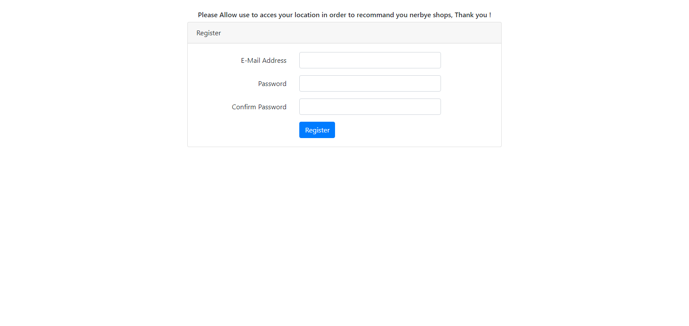
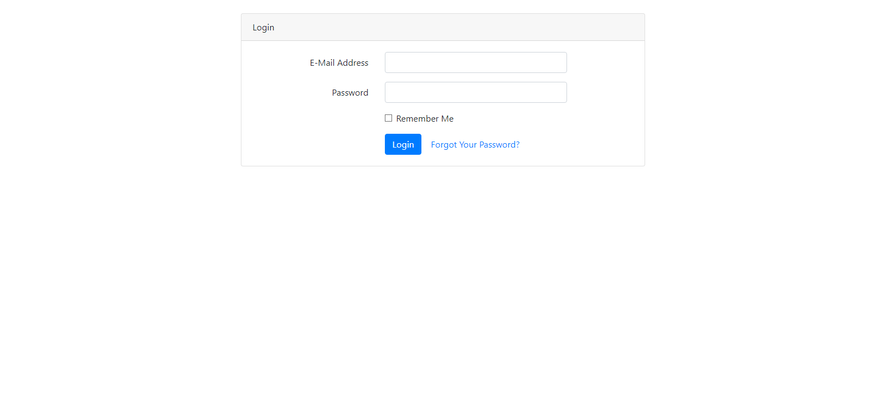
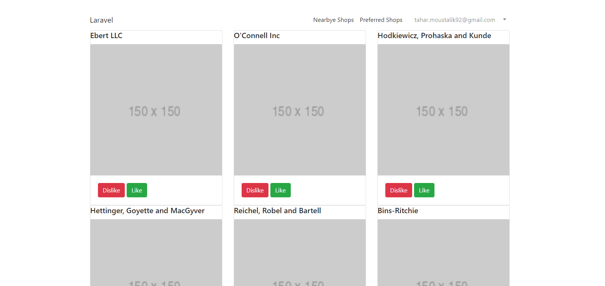
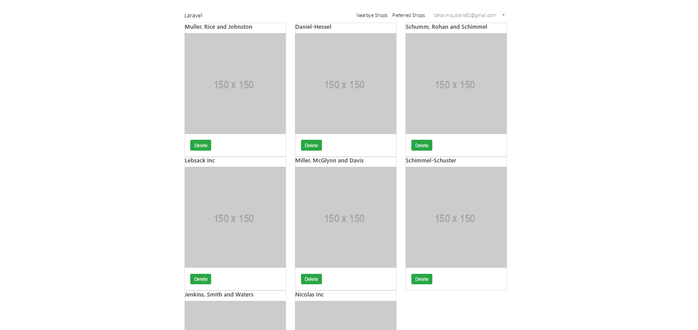

# shops-coding-challenge


## Table of Content:
  - [Idea of the app](#idea-of-the-app)
  - [Features](#features)
  - [Technologies used](#technologies-used)
  - [Folder structure](#folder-structure)
  - [Steps to Install](#steps-to-install)
  - [Screenshots](#screenshots)

This is a Full-Stack web coding challenge.
( https://github.com/tahar-moustalik/shops-coding-challenge.git )
## Idea of the app
The task is to implement an app that lists shops nearby.

## Features
- As a User, I can sign up using my email & password
- As a User, I can sign in using my email & password
- As a User, I can display the list of shops sorted by distance
- As a User, I can like a shop, so it can be added to my preferred shops
  - Acceptance criteria: liked shops shouldn’t be displayed on the main page
- As a User, I can dislike a shop, so it won’t be displayed within “Nearby Shops” list during the next 2 hours
- As a User, I can display the list of preferred shops
- As a User, I can remove a shop from my preferred shops list

## Technologies used
- Backend: PHP, Laravel Framework
- Frontend: Bootstrap 4, Blade Template Engine, JavaScript

## Folder structure
- The backend folder contains the Express JS app
- The frontend folder contains the React app

## Steps to install
- Clone the current repository : ```https://github.com/tahar-moustalik/shops-coding-challenge.git```
- move cloned repository into the server folder , htdocs in case of xampp
- open a terminal or shell in the project directory
- then run ```composer install ```  to install all dependencies

- then run ```php artisan key:generate ``` to get a new key for the app
- Import the shops.sql into a mysql database
- copy .env.example into a .env file 
- fill in your database info in .env parameters


## Screenshots
- Register :



- Sign-in :



- List nearby shops:



Add and Remove shops from preferred shops list:


